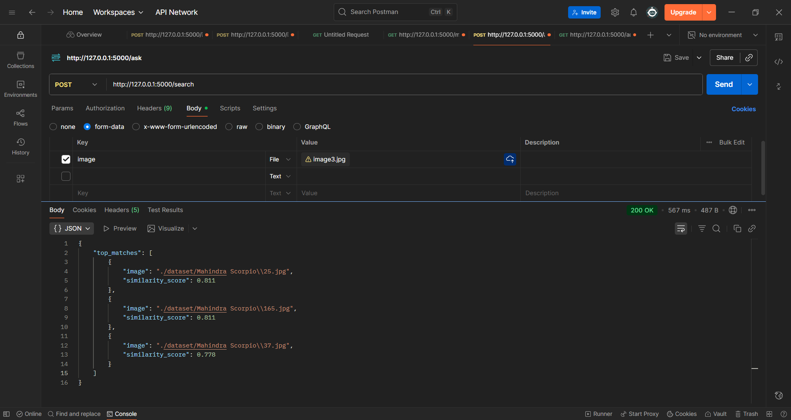
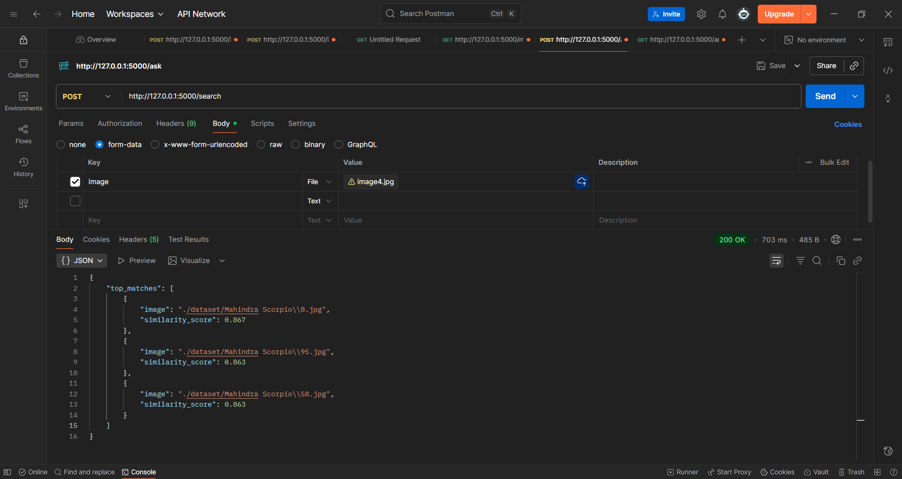

#  Image Similarity Search 

This is a flask based Image Similarity Search app  with more than 150 car images in the dataset.
Workflow: User upload an image > Image is embedded using CLIP >  FAISS is used to search similarity
and return top 3 matches and similarity score from the dataset. All the similar images are stored
in embeddings.json.  

## Features:

* def generate_embeddings(): To generate the embedding of the images saved in 
                             dataset folder (only if they are in .jpg, .jpeg and .png) 
                             and save it in embeddings.json
* @app.route('/search', methods=['POST']): for the following purposes:
       
        1. Checking the uploaded file
        2. Read and pre process image
        3. Encode images
        4. Perform FAISS search
        5. Return the response in JSON format

* Dataset: Contains different type of images of Scorpio and Audi.
* Device: To run the model on cpu

## Technologies used:

1. Flask: For Backend
2. CLIP: To generate the embedding of the images
3. FAISS: Facebook AI Similarity Search for faster search
4. torch: To run the CLIP model
5. numpy: To change the data type
6. PIL: To open preprocessed uploaded images.

### Sample Output:

1. 

2. 

3. 